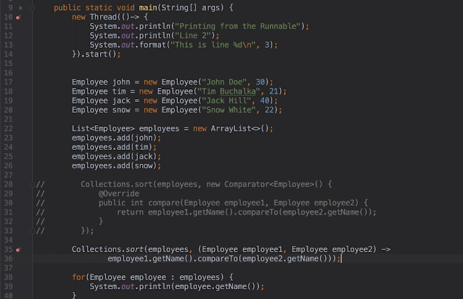
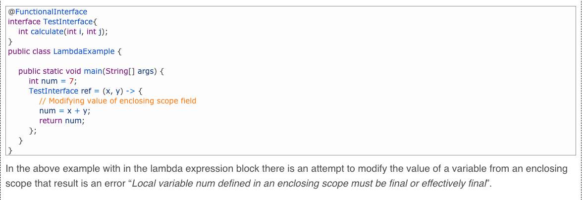
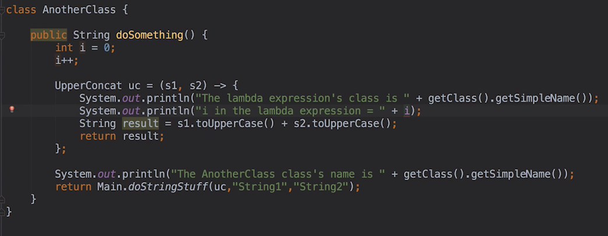

# Lambdas

  Lamda expressions reduce the amount of code you need to write.
- Can only be used for interfaces that require the implementation of only one method.
   

 

 Below is an image of how you would sort an ArrayList using Collections.sort the traditional way and by using a lambda expression.  

 

Lambda expressions Consists of 3 parts:
1. the argument list
2. an arrow token
3. the body

#### Lambda Argument List:  
  
- the method parameters become the argument list.  

#### Lambda Arrow Token:
  
- the arrow token is always there.

#### Lambda Body:
  
- the body of the method becomes the body of the lambda expression.

The compiler can infer from the first parameter that the objects to be compared are of type Employee, so we can simplify the expression even further by leaving the type out of the parameter:  
  

If there is only one parameter, we do not need to include the parenthesis.

To use lambdas, you still need to define the interface class.  

#### Interface Example Without Lambda Expression:  
  
  
- the bottom photo above shows the implemented interface method.  
- note that the above method is all located in the parameter of method, doStringStuff.
#### Interface Example With Lambda Expression:  
  
  
- the bottom photo above shows the implemented interface method.
- notice that the return statement is not included.  
- - when the lambda statement consists of a single statement that evaluates to a value, the return statement is assumed and the return value is inferred to be the type of the evaluated value.  
  
  
- in this case the value is string.  
- the compiler can also infer the types of the parameters, so we don't need to include those either.
  
  

Now that we have our lambda, we can use it as the first parameter in our call to do string stuff.  
  

The above code could be shortened further by not saving it to a variable, but this shows we can define the lambda once and then use it wherever we need it.  
- if it contained more than one statement, we would have to use the return statement.  

  
- we also need curly braces here bc the body now has more than one statement  
- for the same reason, we also need a semicolon at the end.  

#### Lambda Expressions & Scope:  
Lambda expressions in Jave do not have a scope of their own, they have the same scope as its enclosing scope.  
- it returns an error if a variable is defined within the lambda expression that has the same name as a variable in its enclosing scope.  
  
  
The above expression will result in an error as the parameter used within the lambda expression has the same name as the local variable s1 already defined.

Since lamda expresssions do not introduce a new level of scoping, you can directly access fields, methods, and local variables of the enclosing scope.  
- However, they can only access local variables and parameters of the enclosing scope that are final or effectively final.  
- An effectively final variable in Jave is one whose value can't be modified once it is assigned.  
  

The below code will not get an error:  
  
However, if we change the value of i, we do get an error because the field must be effectively final:  
  
  

  

>

